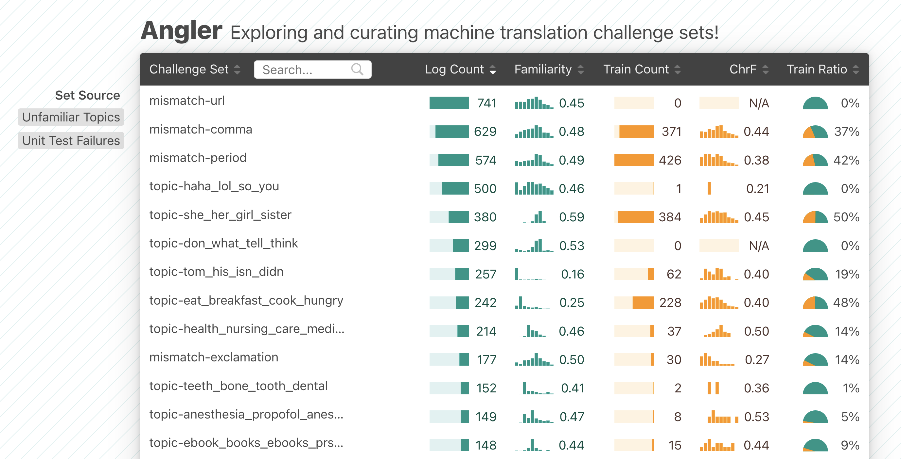

# Angler: Machine Translation Visualization

Angler is an interactive visualization system that helps machine translation (MT) engineers and researchers explore and curate challenge sets to improve their models and data. Challenge sets (sometimes called "golden sets" or "aggressor tests") are often small, curated sets of important data samples, which ML practitioners use to validate and monitor an ML model's behavior. We used Angler to understand how ML practitioners prioritize model improvements when the input space is infinite and obtaining reliable signals of model quality is expensive.

This code accompanies the research paper:

**[Angler: Helping Machine Translation Practitioners Prioritize Model Improvements](https://machinelearning.apple.com/research/translate-vis)**  
Samantha Robertson*, Zijie J. Wang*, Dominik Moritz, Mary Beth Kery, Fred Hohman  
_ACM Conference on Human Factors in Computing Systems (CHI), 2023._  
\*Contributed equally.
[Paper][paper], [Interactive demo][demo], [Code][code]

## How to Use Angler?

### Main Features

- Visually explore machine translation data over time
- Compare translation datasets (e.g., usage log data versus training data)
- Surface potentially interesting and critical data samples with two sources:
  - Model's unfamiliar topics
  - Failure cases of model unit tests

### Table View

Each row in the table represents a challenge set. Each set contains English-to-Chinese translation pairs from a translation dataset composed from 4 open source datasets: `scientific_papers` (corpus of full-text scientific articles), `tatoeba` (open-source translation data), `umass_global` (English language tweets from 2014-2016), and `wmt_chat` (customer service chat histories). These sets are generated because they contain unfamiliar topics or failed certain unit tests.



To sort the challenge sets, click any metric in the table header. The metrics include:

| Column            | Description                                                                                           |
| :---------------- | :---------------------------------------------------------------------------------------------------- |
| **Challenge Set** | Automatically generated name of the set                                                               |
| **Log Count**     | Number of log translation samples in the set                                                          |
| **Familiarity**   | Average of likelihoods of observing usage logs in the set under the distribution of all training data |
| **Train Count**   | Number of training samples in the set                                                                 |
| **ChrF**          | Average of sentence-level ChrF scores of samples in the set with target translation available         |
| **Train Ratio**   | Percentage of training data in the set                                                                |

### Challenge Set Preview

To preview a challenge set, click any row in teh Table View. The preview includes 100 sentences and the most representative keywords from the challenge set.


### Detail View

To see more details about a particular challenge set, click the `Show Details` button to open the Detail View.

The Detail View provides multiple visualizations to help users explore a particular challenge set. The visualizations include:

| Chart              | Description                                                           |
| :----------------- | :-------------------------------------------------------------------- |
| **Timeline (top)** | Number of usage logs by their request time                            |
| **Keywords**       | Most representative keywords                                          |
| **Embedding**      | Embedding view of latent representation of sentences                  |
| **ChrF**           | Count distribution of ChrF scores (measure of translation quality)    |
| **Familiarity**    | Count distribution of model's familiarity of sentences                |
| **Input Source**   | Count distribution of sentences across dataset sources                |
| **Unit Tests**     | Count distribution of sentences that are also in other challenge sets |

To focus on sentences with interesting attributes (e.g., from a particular time, with low familiarity, or from a specific dataset), users can create filters by brushing or clicking throughout the visualizations.


## Development

To build and develop Angler locally:

```bash
# Install dependencies
npm install

# Start a localhost server
npm run dev

# Navigate to localhost:5173 in any browser
```

## Contributing

When making contributions, refer to the [`CONTRIBUTING`](CONTRIBUTING.md) guidelines and read the [`CODE OF CONDUCT`](CODE_OF_CONDUCT.md).

## BibTeX

To cite our paper, please use:

```bibtex
@inproceedings{robertson2023angler,
  title={Angler: Helping Machine Translation Practitioners Prioritize Model Improvements},
  author={Robertson, Samantha and Wang, Zijie J. and Moritz, Dominik and Kery, Mary Beth and Hohman, Fred},
  booktitle={Proceedings of the SIGCHI Conference on Human Factors in Computing Systems},
  year={2023},
  organization={ACM},
  doi={10.1145/3544548.3580790}
}
```

## License

This code is released under the [`LICENSE`](LICENSE) terms.

[paper]: https://machinelearning.apple.com/research/helping-machine-translation
[demo]: https://apple.github.io/ml-translate-vis/
[video]: https://machinelearning.apple.com
[preview]: https://machinelearning.apple.com
[code]: https://github.com/apple/ml-translate-vis/
